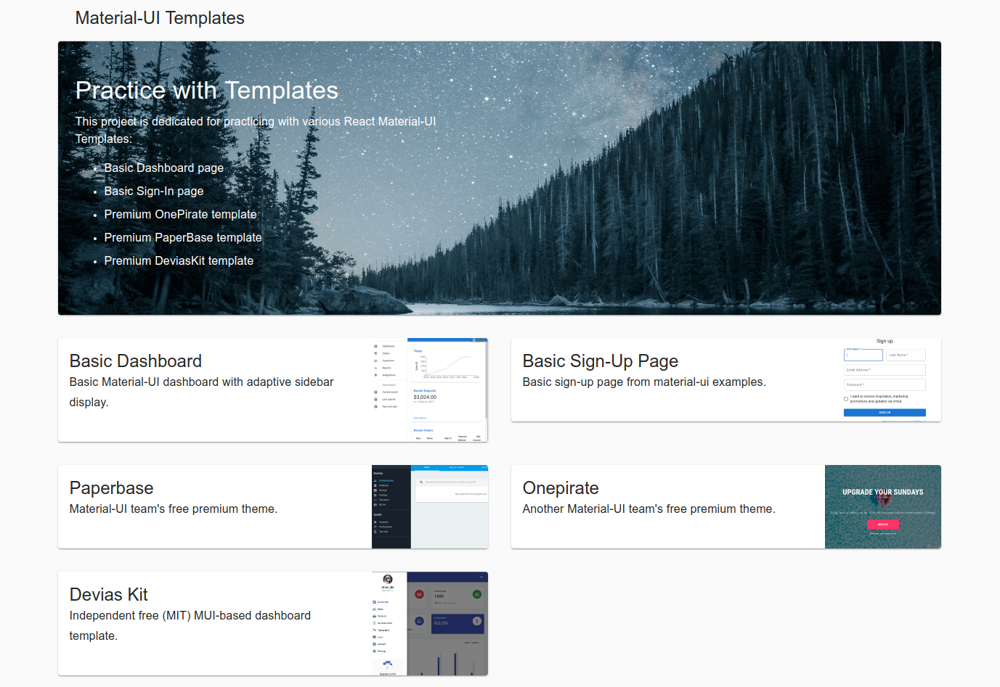
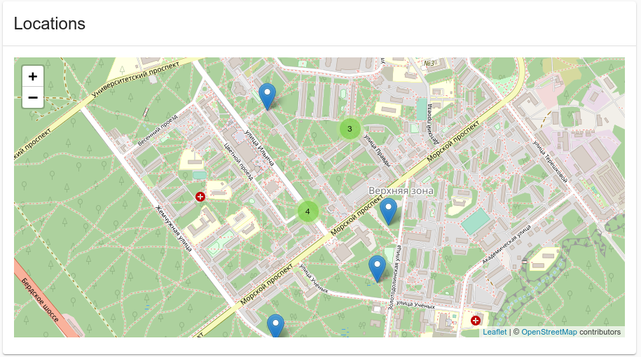

# React + Material-UI Templates

This project is dedicated for practicing with various 
React Material-UI Templates:
 * Basic Dashboard page
 * Basic Sign-In page
 * Premium OnePirate template
 * Premium PaperBase template
 * Premium DeviasKit template

All templates will be rendered using the Next.js for the 
sake of fastest prototyping (and as there is not backend
logic at all :) )

<p align="center">
    
</p>

## Setup a New Project

First of all we need to install all required dependencies:
```shell script
npm init -y
npm install --save react react-dom prop-types @material-ui/core @material-ui/icons next
```

Next, add the `next.js` scripts to the `package.json`
```json
{
  "scripts": {
    "dev": "next",
    "build": "next build",
    "start": "next start"
  }
}
```

## Using Markdown Elements

Install `markdown-to-jsx` package:
```shell script
npm install --save markdown-to-jsx
```

Configure Markdown to use Material-UI components:
```jsx harmony
import React from "react";
import ReactMarkdown from 'markdown-to-jsx';
import Typography from '@material-ui/core/Typography';

const options = {
    overrides: {
        h1: {
            component: Typography,
            props: { gutterBottom: true, variant: 'h4' },
        },
        // etc....
    },
};

export default function Markdown(props) {
    return <ReactMarkdown options={options} {...props}/>
}
```

Prepare Markdown text to be imported to the js-components. 

Install `raw-loader`:
```shell script
npm install --save raw-loader
```

Configure `Webpack` to recognize `md` files as 'raw' files. 
In our case we're using `Next.js` as a fronted framework. 
So we will need to add Webpack rules to the `next.config.js` file:
```js
// next.config.js is not transformed by Babel. So you can only use
// javascript features supported by your version of Node.js.
module.exports = {
    webpack: (config, options) => {
        config.module.rules.push({
            test: /\.md$/,
            loader: 'raw-loader',
        });
        return config
    },
};
```

Then we may insert compiled markdown into our components:
```jsx harmony
import React from "react";
import Markdown from "../src/components/Markdown";
import description from "../src/landing/description.md";

export default props => (
    <div>
        <Markdown>{description}</Markdown>
    </div>
);
```

## Class Composition with `clsx`

Some of the templates are using [clsx](https://github.com/lukeed/clsx) - a tiny utility to dynamically combine CSS classes. 

Installation: 
```shell script
npm install --save clsx
```

Usage:
```js
import React, {useState} from "react"
import clsx from "clsx";

export default function MyComponent() {
    const [open, setOpen] = useState(false);
    return <div className={clsx('content', open && 'open')}>Hello</div>    
}
```

## Transitions with `@material-ui/styles`

Material-UI theme provides a great API to manage transitions:
```jsx harmony
const useStyles = makeStyles(theme => ({
  open: {
    width: 100,
    // this idiomatic method call will generate 
    // the required transition spec. 
    transition: theme.transitions.create(['width'], {
      easing: theme.transitions.easing.sharp,
      duration: theme.transitions.duration.leavingScreen,
    }),
  },
  close: {
    width: 0,
    transition: theme.transitions.create(['width'], {
      easing: theme.transitions.easing.sharp,
      duration: theme.transitions.duration.leavingScreen,
    }),
  },
}));
```
Then in the Component definition:
```jsx harmony
export default function MyComponent() {
    const classes = useStyles();
    return (
        <div className={clsx(open && classes.open, !open && classes.close)}>Hello</div>
    );
}
```
For more details on how the corresponding CSS works, see the following 
[guide](https://css-tricks.com/almanac/properties/t/transition/).

## CSS Breakpoints with `@material-ui/styles`

Material-UI defines a consistent set of predefined CSS-breakpoints. These breakpoints
are accessible via the `Theme` API. 

For example: 
```jsx harmony
const styles = makeStyles(theme => ({
  root: {
    backgroundColor: theme.palette.primary.main,
    [theme.breakpoints.down('sm')]: { 
      backgroundColor: theme.palette.secondary.main,
    },
  }
}));
```  
The root will have secondary background-color on large screens down to the small (`sm`) screen sizes. 

See Material-UI documentation on this topic: [Breakpoints/](https://material-ui.com/customization/breakpoints/).

Breakpoints is a technique to define adaptive CSS styles. The core idea behind breakpoints is to 
**apply styles conditionally**. To impose such conditions on portions of style-sheets you typically 
use `@media` query - a specialized CSS API to check if the device meets some criteria.

The `[theme.breakpoints.down('sm')]` will simply generate a `@media` query according to the provided arguments.

For more details on `@media` queries please see this docs: 
[CSS/Media](https://developer.mozilla.org/en-US/docs/Web/CSS/@media)

`@media` query is an example of at-rules. For general description of CSS at-rules please see this docs: 
[CSS/At-rule](https://developer.mozilla.org/en-US/docs/Web/CSS/At-rule) 

## Using CSS Mixins

Material-UI theme API provides a nice way to reuse predefined styles of standard UI elements. 

To merge your custom styles with predefined you basically spread the corresponding mixin:

```jsx harmony
const useStyles = makeStyles(theme => ({
    // drawer's close-button styles:
    closeButton: {
        display: 'flex',
        alignItems: 'center',
        justifyContent: 'flex-end',
        // make sure close-button size fits the toolbar size:
        ...theme.mixins.toolbar,
    },

    // By using toolbar mixin we ensure spacer to be
    // of the same height as the app-bar.
    contentAppBarSpacer: theme.mixins.toolbar,
}));
``` 
See for example here: [pages/dashboard/mini/index.js#L111](https://github.com/stepan-anokhin/practice-mui-templates/blob/master/pages/dashboard/mini/index.js#L111)

## Using Maps with `react-leaflet`

**Step 1.** Install `react-leaflet` and its dependencies. 
```shell script
npm install --save leaflet leaflet.markercluster react-leaflet react-leaflet-markercluster
``` 
`leaflet.markercluster` and `react-leaflet-markercluster` are required to have a nice
marker clustering (see the 
[Leaflet/Leaflet.markercluster](https://github.com/Leaflet/Leaflet.markercluster#leafletmarkercluster) 
docs for more details). 
<p align="center">
    
</p>

For some reason when `react-leaflet-markercluster` is installed like shown above
it has an older version (like `^1.*`) incompatible with the latest `react-leaflet`. 
This leads to the following error:
```
Uncaught TypeError: Super expression must either be null or a function, not object
```
To solve this problem do the following. 
1. Change `react-leaflet-markercluster` version to `^2.0.0-rc3` in your `package.json`
2. Update dependencies (e.g. by removing `package-lock.json` and re-installing it with `npm install`)

The issue should be resolved after that. See this issue for more details: 
[react-leaflet-markercluster/issues/92](https://github.com/YUzhva/react-leaflet-markercluster/issues/92) 

**Step 2.** Include leaflet styles as global CSS. Otherwise tile-layer will not be displayed properly 
(this leads to problems like this one from stackoverflow: 
[react-leaflet map not correctly displayed](https://stackoverflow.com/questions/40365440/react-leaflet-map-not-correctly-displayed)

According to leaflet [docs](https://leafletjs.com/examples/quick-start/) we need to include:
```html
<link rel="stylesheet" href="https://unpkg.com/leaflet@1.5.1/dist/leaflet.css">
```

As we are using `Next.js` (long live Next.js for all the simplicity in brings!) we will need to include required 
style-sheets into `Next.js`'s `Head` component wrapped around our own react-components.
```jsx harmony
import Head from "next/head";

export default function Index() {
    return (
        <React.Fragment>
            <Head>
                <title>Mini variant Drawer</title>
                <link rel="stylesheet" href="https://unpkg.com/leaflet@1.0.1/dist/leaflet.css" />
                <link rel="stylesheet" href="https://unpkg.com/react-leaflet-markercluster/dist/styles.min.css" />
            </Head>
                <Page/>
        </React.Fragment>
    );
}
``` 

The `https://unpkg.com/react-leaflet-markercluster/dist/styles.min.css` is required for the marker-clustering.

**Step 3.** As we are using `Next.js` (long live Next.js for all the simplicity in brings!) we will need to 
wrap `react-leaflet`'s `Map` component into the `next/dynamic` to make it be imported only on client side.
This is required because leaflet uses the `window` variable which is not defined on server side. 
```jsx harmony
import dynamic from "next/dynamic";
const DynamicLeafletMap = dynamic(() => import("./LeafletMap"), {ssr: false});
```
`DynamicLeafletMap` then could be used as normal component without causing the errors on backend. 

More on this issue: 

* https://github.com/zeit/next.js/wiki/FAQ#i-use-a-library-which-throws-window-is-undefined
* https://github.com/zeit/next.js#with-no-ssr


## Errors

### Prop `className` did not match

##### Description
When page is reloaded the page's layout is displayed 
incorrectly and there is a Warning in the console:
```
index.js:1 Warning: Prop `className` did not match. 
Server: "MuiToolbar-root MuiToolbar-regular makeStyles-toolbar-46 MuiToolbar-gutters" 
Client: "MuiToolbar-root MuiToolbar-regular makeStyles-toolbar-1 MuiToolbar-gutters" 
    in div (created by Toolbar)
    in Toolbar (created by WithStyles(ForwardRef(Toolbar)))
    in WithStyles(ForwardRef(Toolbar)) (at pages/​index.js:40)
    in Index (created by App)
    in App
```

This is a particularly hard-to-fix bug. Here is what is know so far: 
* It happens when page is reloaded.
* It is reproducible without `next.config.js`
* It is reproducible without `.babelrc`
* It is well-known bug. See the following issues:
  * [zeit/next.js/issues/7322](https://github.com/zeit/next.js/issues/7322)
  * [styled-components/issues/1239](https://github.com/styled-components/styled-components/issues/1239)

##### Solution

Still Reproducible. 

This 
[comment](https://github.com/styled-components/babel-plugin-styled-components/issues/78#issuecomment-361160935)
 is several times mentioned as a working solution: 

The issue with exactly (?) the same error-message is raised for `babel-plugin-styled-components`
so this is probably a `babel-plugin-styled-components`'s problem. 
